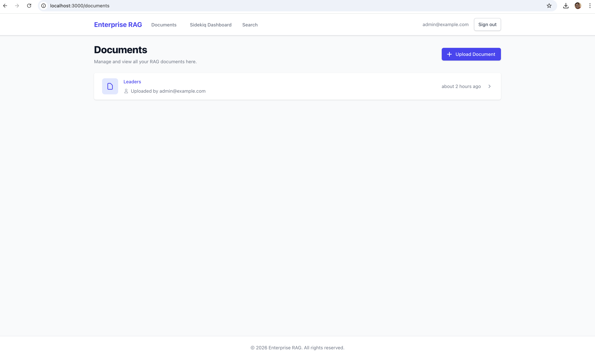
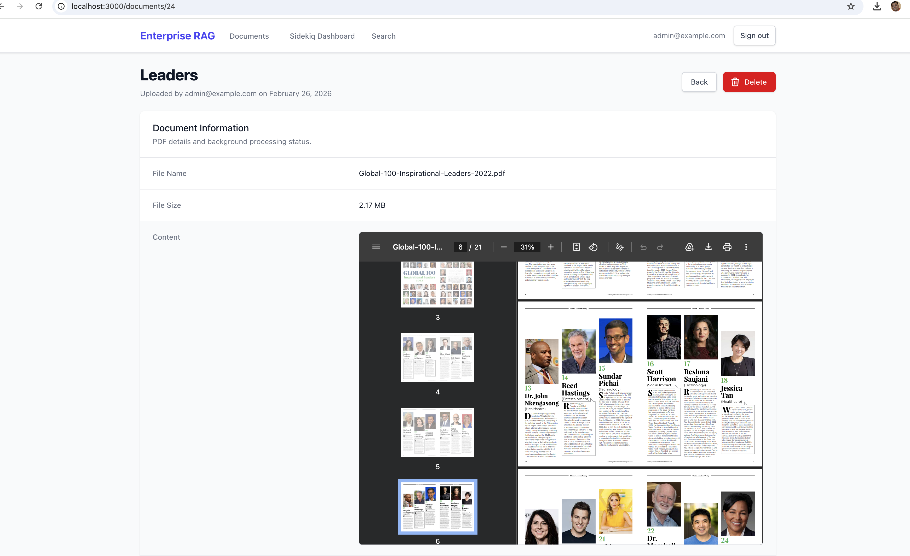
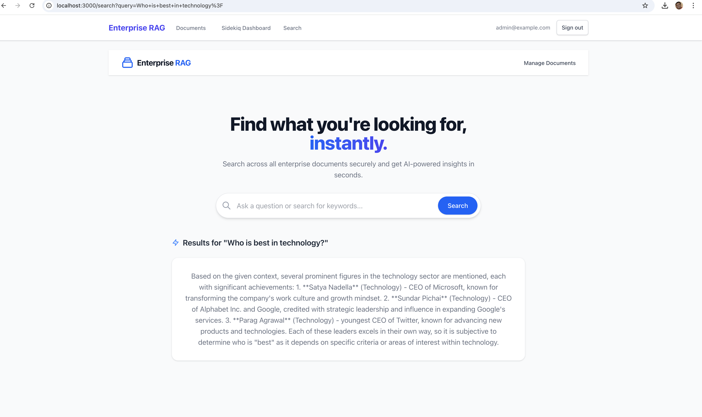

# Enterprise RAG

Enterprise RAG is a comprehensive, production-ready document processing and AI-powered search platform. Built with a modern Ruby on Rails frontend and an API-driven AI integration layer, this application enables secure, agentic Retrieval-Augmented Generation (RAG) across your organization's internal documents.


## Features

- **Robust Document Management:** Upload, store, and manage PDF documents seamlessly using Active Storage and PostgreSQL.
- **AI-Powered Search Engine:** A sleek, minimalist, public-facing search page that utilizes natural language processing to deliver context-aware answers and semantic search results across your company's documents.
- **Background Processing:** Powered by Sidekiq and Redis, document ingestion (parsing, chunking, and embedding creation) and deletion are handled asynchronously to ensure a highly responsive user experience.
- **Microservices Architecture:** The Rails application acts as the elegant user-interface and data API orchestrator, delegating complex AI and vector operations to a dedicated Python backend via Faraday HTTP requests.
- **Secure Admin Access:** Document management features are secured via the Devise authentication gem, restricting upload and administration capabilities to verified admins only.
- **Modern UI/UX:** Styled with TailwindCSS, the application provides a highly polished, responsive, and intuitive interface for both public searchers and administrators.

## Tech Stack

### Core
- **Ruby on Rails 8.1+**
- **Ruby 3.2+** 
- **PostgreSQL:** Primary relational database.
- **Redis & Sidekiq:** Background job processing queue.

### Frontend
- **TailwindCSS:** Utility-first CSS framework for styling.
- **Hotwire (Turbo & Stimulus):** Fast, SPA-like page transitions and minimal-JS interactivity.

### Integration
- **Faraday / Faraday Multipart:** Used for communicating with the external Python AI microservice (handling multi-part file uploads and JSON queries).
- **Active Storage:** For handling local PDF file uploads and yielding temporary file paths to the background workers.

## Flow Architecture

1. **Upload:** An admin uploads a PDF via the secure `/documents` dashboard.
2. **Background Job:** Rails enqueues a `PdfUploadJob` into Sidekiq.
3. **AI Processing:** The Sidekiq worker streams the PDF file to a Python AI service (`http://localhost:8000/process-pdf`) via a multipart HTTP POST request.
4. **Indexing:** The Python service parses the PDF, chunks the text, computes vector embeddings, and stores them in a vector database.
5. **Retrieval:** A user queries the public `/search` endpoint. Rails relays this query to the AI service, which performs a semantic vector search and returns ranked, context-aware results.

## Requirements

- Ruby 3.2+
- PostgreSQL
- Redis (for Sidekiq)
- An active instance of the accompanying Python AI Document Processing Service running on `localhost:8000` (or configured otherwise).


## 📸 Application Screenshots

### Document Dashboard




### AI Search Response


### FastAPI Documentation


### Qdrant Database UI


## Setup & Installation

1. **Clone the repository:**
   ```bash
   git clone https://github.com/your-username/enterprise_rag.git
   cd enterprise_rag
   ```

2. **Install Ruby dependencies:**
   ```bash
   bundle install
   ```

3. **Install Frontend dependencies:**
   ```bash
   bin/rails tailwindcss:install
   ```

4. **Setup the Database:**
   Ensure PostgreSQL is running, then execute:
   ```bash
   bin/rails db:create db:migrate
   ```

5. **Start Redis server:**
   (Required for Sidekiq background jobs)
   ```bash
   redis-server
   ```

6. **Run Sidekiq:**
   In a new terminal window, start the background worker process:
   ```bash
   bundle exec sidekiq
   ```

7. **Start the Rails server:**
   ```bash
   bin/rails server
   ```

The application will now be available at `http://localhost:3000`. 
- **Public Search:** `http://localhost:3000/search`
- **Admin Dashboard:** `http://localhost:3000/documents`

## Contributing

Bug reports and pull requests are welcome on GitHub at https://github.com/your-username/enterprise_rag. This project is intended to be a safe, welcoming space for collaboration, and contributors are expected to adhere to the code of conduct.

## License

The application is available as open source under the terms of the [MIT License](https://opensource.org/licenses/MIT).